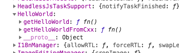

## react-native 的custom helloworld(Android)


### custom package
自定义一个包含java方法、c++方法、自定义视图的Package

#### 1. 构造一个Package
ReactPackage是集中注入自定义的原生方法、原生视图的“包裹”。
`testRn/android/app/src/main/java/com/testrn/myModules/MyPackage.java`

```
package com.testrn.myModules;

import com.facebook.react.ReactPackage;
import com.facebook.react.bridge.JavaScriptModule;
import com.facebook.react.bridge.NativeModule;
import com.facebook.react.bridge.ReactApplicationContext;
import com.facebook.react.uimanager.ViewManager;
...

public class MyPackage implements ReactPackage {

    // 1. 自定义视图在此注入
    @Override
    public List<ViewManager> createViewManagers(ReactApplicationContext reactContext) {
        return new ArrayList<>();
    }

    // 2. 自定义Native方法在此注入
    @Override
    public List<NativeModule> createNativeModules(ReactApplicationContext reactContext) {
        List<NativeModule> modules = new ArrayList<>();
        return modules;
    }

    // 3. 自定义JS模块在此注入
    public List<Class<? extends JavaScriptModule>> createJSModules() {
        return new ArrayList<>();
    }
}
```

### 2. 把Package注入到NativeModules中
在项目的`MainApplication`中通过`ReactNativeHost`注入
`testRn/android/app/src/main/java/com/testrn/MainApplication.java`
```
public class MainApplication extends Application implements ReactApplication {

  private final ReactNativeHost mReactNativeHost = new ReactNativeHost(this) {
    @Override
    public boolean getUseDeveloperSupport() {
      return BuildConfig.DEBUG;
    }

    @Override
    protected List<ReactPackage> getPackages() {
      return Arrays.<ReactPackage>asList(
          new MainReactPackage(),
          new MyPackage() // <---- 此处实例化你的Package
      );
    }

    @Override
    protected String getJSMainModuleName() {
      return "index";
    }
  };

```
我们已经完成了初始化步骤，Package内的自定义内容(暂时没有东西)会被注入到NativeModules中，现在开始往里面加料。

#### 3. 构造一个自定义的Module并添加一个Native方法(java)
* 新建一个Module `testRn/android/app/src/main/java/com/testrn/myModules/HelloWorld.java`

* 新建一个方法，并通过注解`@ReactMethod`来暴露给js端使用

* js通过`NativeModules.HelloWorld.getHelloWorld`来获取到内容

```
package com.testrn.myModules;

...
import com.facebook.react.bridge.ReactApplicationContext;
import com.facebook.react.bridge.ReactContextBaseJavaModule;
...

public class HelloWorld extends ReactContextBaseJavaModule {
    public HelloWorld(ReactApplicationContext reactContext) {
        super(reactContext);
    }

    // 1. module的名字, js通过NativeModules来获取
    @Override
    public String getName() {
        return "HelloWorld";
    }

     // 2. 注解一个供js调用的方法
    @ReactMethod
    public void getHelloWorld(Promise promise) {
        promise.resolve("hello world, " + android.os.Build.MODEL);
    }

}
```
1. 此处用的是`Promise`风格, 在js端调用即`NativeModules.HelloWorld.getHelloWorld().then(res => {})`
2. 还可以用`Callback`风格，把`getHelloWorld`修改一下：
```

    @ReactMethod
    public void getHelloWorld(Callback cb) {
        try {
            cb.invoke(null, "hello world, " + android.os.Build.MODEL);
        } catch (Exception e) {
            cb.invoke(e.toString(), null);
        }
    }
```

然后在前面的`MyPackage`中注入`HelloWorld`Module
```
public class MyPackage implements ReactPackage {
    ...
    // 2. 自定义Native方法在此注入
    @Override
    public List<NativeModule> createNativeModules(ReactApplicationContext reactContext) {
        List<NativeModule> modules = new ArrayList<>();
        modules.add(new HelloWorld(reactContext)); // <---- 注入HelloWorld的Module
        return modules;
    }
    ...
}
```
此时在js端进行测试，已经可以成功调用到native的方法了。

### 自定义一个来自c++的方法(jni)
依然是在`MyPackage`的`HelloWorld`上添加方法，不过方法的实现并非java而是用c++，这时候就要用到`jni`了。

> c/c++代码需要编译成so文件被加载后才可以调用

```
package com.testrn.myModules;
...

public class HelloWorld extends ReactContextBaseJavaModule {
    public HelloWorld(ReactApplicationContext reactContext) {
        super(reactContext);
    }

    // 1. 定义一个来自底层的方法，后面在c层实现它
    public native String getHello();

    // 1. 加载编译后的so库，名字为hellojni，在编译文件里面配置
    static {
        System.loadLibrary("hellojni"); //this loads the library when the class is loaded
    }

    ...
    // 2. 依然是通过注解暴露出去
    @ReactMethod
    public void getHelloWorldFromCxx(Promise promise) {
        try {
            String hello = getHello(); // <---- 此处调用的就是jni的方法了
            promise.resolve(hello);
        } catch (Exception e) {
            promise.reject("ERR", e);
        }
    }
}

```
编写c++代码：
1. 新建一个放置jni代码的目录： `testRn/android/app/src/main/jni`
2. hello.cpp、hello.h
```
// hello.cpp
#include <jni.h>       // JNI header provided by JDK
#include "hello.h"  // Generated

using namespace std;

// Implementation of the native method getHello()
JNIEXPORT jstring JNICALL Java_com_testrn_myModules_HelloWorld_getHello(JNIEnv *env, jobject thisObj) {
	// cout << "Hello World from C++!" << endl;
    jstring hello = (env)->NewStringUTF("Hello from C++");
    return hello;
}
```

```
// hello.h//
#ifndef TESTRN_HELLO_H
#define TESTRN_HELLO_H

#ifdef __cplusplus
extern "C" { // 按c语言编译
#endif
JNIEXPORT jstring JNICALL Java_com_testrn_myModules_HelloWorld_getHello(JNIEnv *, jobject);
#ifdef __cplusplus
}
#endif

#endif
```

3. 此处我们采用`ndk-build`的方案来编译，编写`Application.mk`与`Andorid.mk`编译配置文件
```
// testRn/android/app/src/main/jni/Application.mk
APP_ABI := all
APP_STL := c++_static
```
```
// testRn/android/app/src/main/jni/Andorid.mk

LOCAL_PATH := $(call my-dir)

include $(CLEAR_VARS)

LOCAL_SRC_FILES := hello.cpp
LOCAL_MODULE := hellojni

include $(BUILD_SHARED_LIBRARY)

```
4. 在Android Studio中链接源码，如右键jni文件夹`Link C++ Project with Gradle`，选择`ndk-build`方案
> 此外，在android中利用c/c++代码的构建方法还有cmake, [详情](https://developer.android.com/studio/projects/add-native-code?utm_source=android-studio#link-gradle)

5. 构建app就可以使用到该方法了
`NativeModules.HelloWorld.getHelloWorldFromCxx().then(res => console.log(res))`

### 创建一个自定义视图组件
[官方demo](https://facebook.github.io/react-native/docs/native-components-android)

1. 新建一个ViewManager，利用注解`@ReactProp`设置组件的props

`testRn/android/app/src/main/java/com/testrn/myModules/HelloWorldViewManager.java`
```
package com.testrn.myModules;

import android.widget.ProgressBar;

import com.facebook.react.uimanager.SimpleViewManager;
import com.facebook.react.uimanager.ThemedReactContext;
import com.facebook.react.uimanager.annotations.ReactProp;

public class HelloWorldViewManager extends SimpleViewManager<ProgressBar> {
    // 1. 名称
    public static final String REACT_CLASS = "RTCHelloWorldView";

    @Override
    public String getName() {
        return REACT_CLASS;
    }

    @Override
    protected ProgressBar createViewInstance(ThemedReactContext reactContext) {
        return new ProgressBar(reactContext);
    }

    @ReactProp(name = "progress", defaultInt = 0)
    public void setProgress(ProgressBar view, int progress) {
        view.setProgress(progress);
    }

    @ReactProp(name = "indeterminate", defaultBoolean = false)
    public void setIndeterminate(ProgressBar view, boolean indeterminate) {
        view.setIndeterminate(indeterminate);
    }
}
```

在`MyPackage`中实例化
```
...
public class MyPackage implements ReactPackage {
    @Override
    public List<ViewManager> createViewManagers(ReactApplicationContext reactContext) {
        return Arrays.<ViewManager>asList(
           new HelloWorldViewManager() // <----- 实例化注入
        );
    }
    ...
}
```
在reactJs中调用
```
import { requireNativeComponent } from 'react-native';

const RCTTest = requireNativeComponent('RTCHelloWorldView');

<RCTTest progress={50} style={{ width: 10, height: 10}}/>
```

### ReactJS
```
/**
 * Sample React Native App
 * https://github.com/facebook/react-native
 *
 * @format
 * @flow
 */

import React, {Component} from 'react';
import {Platform, StyleSheet, Text, View, NativeModules, Button, requireNativeComponent} from 'react-native';

const RCTTest = requireNativeComponent('RTCHelloWorldView');

type Props = {};
export default class App extends Component<Props> {
    state = {
        count: 0
    };
  handleClick = () => {
    NativeModules.HelloWorld.getHelloWorld().then(res => console.log(res));
    NativeModules.HelloWorld.getHelloWorldFromCxx().then(res => console.log(res)).catch(err => console.log(err))
  }
  render() {
    return (
      <View style={styles.container}>
        <RCTTest progress={50} style={{ width: 10, height: 10}}/>
        <Text style={styles.welcome}>Welcome to React Native!</Text>
        <Text style={styles.instructions}>To get started, edit App.js</Text>
        <Text style={styles.instructions}>{this.state.count}</Text>
        <Text style={styles.instructions}>{instructions}</Text>
        <Button title="click" onPress={this.handleClick}/>
      </View>
    );
  }
}

const styles = StyleSheet.create({...});
```
可以看到效果：

NativeModules：



Click console：

