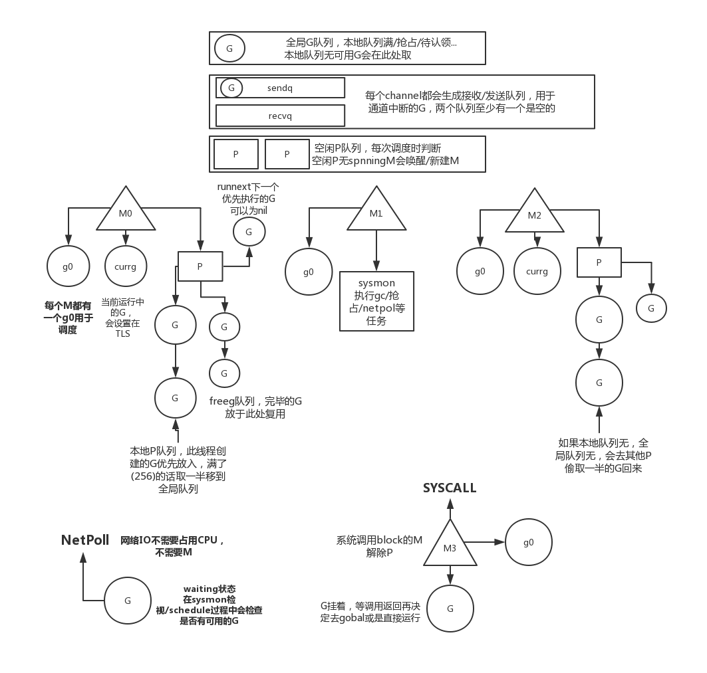

## go协程

* 基于go 1.11源码
* go还很年轻，变化得也很快，学习go的协程实现虽基于源码但不宜深陷源码（细节非常多），指不定哪天实现就重构了一遍 ~~笑~~。当然源码蕴含的宝藏很多。只是本篇尽量不做源码复读机。
* go本身也提供了调试工具链如`go tool compile`、`go tool objdump`、`go run -gcflags "all=-N -l"`等。

# 协程与go协程

## 协程

[wiki](https://zh.wikipedia.org/wiki/%E5%8D%8F%E7%A8%8B) 对协程的定义是：协程是计算机程序的一类组件，推广了非抢先多任务的子程序，允许执行被挂起与被恢复。

CPU的处理速度非常的快，在遇到不能马上得出结果的调用(如IO操作)时，有两种方案：
```
// 同步模式
res = request(...) // 挂起进程/线程，等结果回来再切回来，但是性能消耗大
doSomething(res)   // block
```
```
// 异步模式（epoll/select等方式待有结果返回后通知）
request(function (res) { // 回调通知，不堵塞不切线程，单线程性能高
    doSomething(res) 
})
doOtherthings()        // 紧接着执行
```

可以对比看出同步模式写起来逻辑最清晰但是切换成本高，异步模式性能好但是控制流不够直观清晰，callback hell了解一下。

有没有其他既有异步的高性能又有同步的优雅呢？目前给出了一个答案是协程。

它可以理解为用户态的线程，系统层面并不会感知到协程，协程的调度切换由程序自己控制。

```
// 协程方案
res = request(...) // 让出控制权，但是不用切换线程/进程，仅仅是程序自己实现的切换
doSomething(res)   // block
```

优点:
* 由于运行在用户态，拥有比线程更低的切换成本
    * 毕竟只是多几条指令的消耗比其切换内核态省太多。
* 非抢占式，更灵活地调度

缺点：
* 自行管理栈空间、寄存器
* 性能很依赖调度的策略，需要考虑各种场景下资源分配公平性和避免恶性的协程占用
* 一般来说每次只能运行每个协程，无法享受多核优势

<details>
<summary>为什么说协程切换成本比线程/进程低</summary>

* 操作系统对cpu的使用有两种模式：用户态和内核态。一般来说用户程序是跑在用户态，需要涉及系统调用(如切换内核线程)时会切换为内核态，其中牵扯到特权模式的切换、上下文/寄存器保存与切换、安全校验等等一系列操作。对比协程单纯的保存上下文指令，消耗是差距是很大的。
* PS: 即便是简单的获取系统时间也是涉及到系统调用，在某些某些压力庞大的生产场景下，这也会成为一个严肃的优化点。
</details>

## go协程

传统讨论的协程一般基于1:N，即一条线程对应N个协程，由于每个时刻只能执行一个协程，导致无法充分利用多核CPU的优势。

go的协程是M:N, 即M条线程对应N个协程(由调度器分配，对使用者透明，由此也可见调度算法的重要性)，可以实现真正的并行，充分利用多核。

# MPG模型与调度

## MPG模型
- M - Machine，在go里面相当于真实的线程
- G - goroutine，go里面的协程单位
- P - Processor，存放goroutine运行所需的资源，一般情况下M必须通过P来获取执行goroutine

详情参见源码([runtime/runtime2.go](https://github.com/golang/go/blob/release-branch.go1.11/src/runtime/runtime2.go#L338))中它们的定义。

一个大致的图



简单说明：
* G 即是我们说的goroutine协程，通过`go fn()`来生成。通过调度策略供M执行。
    * g0除外，g0是每个M新建时构造的，用于调度、调整栈大小等。
* M 对应的是真实的线程，它通过P来执行goroutine(G)，与P和G解耦，通过调度策略获取P和G。这也是go协程可以做到M对N的基础。
    * M不会无限创建，目前通过简单的判断当前系统压力大的话不会继续创建M，依赖M的spinning状态
* P 维护了一个本地G队列，M通过P依次获取G来执行，执行完成的G会放入本地的gfree队列供后续复用。
    * P的数量一般来说在初始化完毕后就是固定的，默认是cpu核心数，可以通过GOMAXPROCS来设置。
        * 代码中设置`runtime.GOMAXPROCS(n)`会通过StopTheWorld重新调整
    * P 管理着内存分配器。
* 全局G队列 顾名思义“无家可归”的G会放在这里，被选择的优先级较低，一般是因为P的本地队列满/被抢占出来。
* 每个channel都有队列管理接受者、发送者中断的G

* 一次简单的流程循环：新建/唤醒M -> 获取P -> 通过调度查找G(找不到休眠M，等待信号唤醒继续查找) -> 执行G -> G完毕后继续调度


## `go fn()发生了什么`
`go fn()` 会新建一个go协程，构造它的栈/运行上下文/执行函数，放入P的本地队列等待被M执行。若队列已满则取当前队列的一半丢进全局队列，同时检查是否需要唤醒/新建一个线程去调度。**fn不会马上被执行**([runtime.newproc](https://github.com/golang/go/blob/release-branch.go1.11/src/runtime/proc.go#L3307))

## goroutine什么时候让出控制权

* 显式
    * 本身执行完毕
    * 调用syscall/network
        * 系统调用已经被go封装过
            * 一个syscall会改变G和P的状态，解除P与G的链接
            * 系统调用中M的P可以被抢占
            * 系统调用中M当前执行中的G会等待syscall完毕后再决定是放入全局或是直接运行
        * golang里面的网络IO其实是异步IO，通过channel等机制把控制流改成同步形式
    * channel的发送接收堵塞
* 隐式
    * 抢占
    * gc/stw/栈调整等

<details>
<summary>系统调用的流程代码</summary>

```
// 被封装过的syscall最终去到汇编代码
TEXT	·Syscall(SB),NOSPLIT,$0-56
	CALL	runtime·entersyscall(SB) // 调用entersyscall标记当前g
	...
	MOVQ	trap+0(FP), AX	// syscall entry
	ADDQ	$0x2000000, AX
	SYSCALL
	JCC	ok
	MOVQ	$-1, r1+32(FP)
	MOVQ	$0, r2+40(FP)
	MOVQ	AX, err+48(FP)
	CALL	runtime·exitsyscall(SB) // 完成syscall复用p或重新调度
	RET
ok:
	MOVQ	AX, r1+32(FP)
	MOVQ	DX, r2+40(FP)
	MOVQ	$0, err+48(FP)
	CALL	runtime·exitsyscall(SB) // 完成syscall复用p或重新调度
	RET
```
```
// runtime·entersyscall
casgstatus(_g_, _Grunning, _Gsyscall)
// runtime·exitsyscall
func exitsyscall() {
    ...
    if exitsyscallfast() { // 如果是快速返回无block直接继续
        ...
        return 
    }
    ...
    mcall(exitsyscall0) // 触发重新调度
}
```
</details>


## 调度

内核线程的调度是一般是抢占式的，由上层系统或虚拟机调度，程序无需关注。

但是协程的调度是协作式的，主动让出机制，需要程序自行决定什么时候中断/恢复协程。所以每种协程方案都有自己的调度策略。

go的调度特点是每个协程G都是与M、P解耦的，可以被调度到其他线程执行，即M个线程可以执行N个协程，如何分配由调度策略控制。

- 目标：为当前的M找到可运行状态的goroutine
- 执行调度的时机
    - 新建或唤醒M的时候
    - 停止一个goroutine(如goroutine执行完毕/gopark/gosched等)的时候
- 基本策略 [detail](https://github.com/golang/go/blob/release-branch.go1.11/src/runtime/proc.go#L2557)
    - 调度函数会在当前线程M的P本地队列、全局G队列、GC的G(没错GC也会通过goroutine并行)、网络poll、其他P的本地队列中等等获取可以执行的G。列举一些如下：
        - 优先执行GC的G
        - 全局调度次数每满61次，就去全局goroutine队列获取(一般情况下每次goroutine执行时会次数加一)
        - 在当前M的P中的队列中获取
        - 全局队列
        - 检查netpoll获取
        - **work steal** 去其他p的队列中偷G，每次偷一半 (这是一个比较著名的策略，[更多可读](http://supertech.csail.mit.edu/papers/steal.pdf))
        - 所有P的本地队列
    - 如果没有可用的g，接触p与m的联系，休眠M，下次被唤醒时重新搜索可用G
    - 为了保障随时有可用的M来执行G，每次调度都需要判断是否新建/唤醒一个M [detail](https://github.com/golang/go/blob/release-branch.go1.11/src/runtime/proc.go#L50)
    - 调度过程中，如果满足[**spinning M数量的两倍不小于正在工作的p数量**](https://github.com/golang/go/blob/release-branch.go1.11/src/runtime/proc.go#L2337)会认为资源紧张从而终止该次调度休眠M 
- 新建/唤醒M
    - when
        - 每次创建一个新的goroutine
        - 每次成功获取到一个goroutine
        - channel send数据时
    - 条件：有空闲p且无spinning状态M

## 抢占

为什么有了调度还需要抢占呢？其实是为了弥补公平性。

每一条线程每个时刻只能执行一个协程，如果一个协程长时间执行，当前的线程就无法执行调度函数，那就谈不上切换，资源被某个协程一直占用，导致协作失败。所以需要补充一个抢占的机制，来把控制权抢过来供其他协程使用。

显然，抢占需要一条新的线程。

* 程序开始时会新建一个线程去执行函数[sysmon](https://github.com/golang/go/blob/release-branch.go1.11/src/runtime/proc.go#L4320)，它会定时做强制gc、**抢占**、netpoll等工作
    * 抢占
        * 遍历全部P
        * 正在进行系统调用且经历过一次sysmon的P
        * 运行超过10ms的G
            * 不会马上抢占，而是给予一个抢占标示，在stack空间判断时再实行
            * 意味着一个goroutine只有在下一次执行（**有栈空间检查的**）函数时才会触发中断调度
            * **PS: 个人觉得这种抢占策略并不完美有隐患，见下面的例子**
    * netpoll
        * 获取netpoll中非block的G列表(全局查询间隔时间不超过10ms)，放入全局G队列

<details>
<summary>两个例子说明抢占机制</summary>

以下例子要用`go run -gcflags "all=-N -l"`禁止内联和优化

可以通过`go tool compile -N -l -S test.go > test.asm`查看汇编代码

```
func addTest(a, b, c int) int {
	for {
		add2(a, b) // add2函数不会有栈空间的检查，故尽管add标示了需要抢占，但是不会来到抢占的步骤
	}
	return a + b + c
}

func addTest2(a, b, c int) int {
	for {
		add3(a, b) // add3函数有栈空间的检查，会触发抢占把运行中断并放入全局队列
	}
	return a + b + c
}

func add2(a, b int) int {
    d := a + b
    return d
}

func add3(a, b int) int { // 此函数会添加栈空间的检查
    noop()
    d := a + b
    return d
}

func h() {
    fmt.Println(1)
}

func noop() {}

// 这个例子不会执行h
func main() {
    runtime.GOMAXPROCS(1) // 设置全局只有一个P，所有goroutine只会运行在该M，即单线程执行
	a := 2
	b := 3
	c := 4
	go h()            // h不会执行
	d := addTest(a, b, c) // block住，抢占无效
	fmt.Println(d)
}

// 这个例子会执行h
func main() {
    runtime.GOMAXPROCS(1)
	a := 2
	b := 3
	c := 4
	go h()            // 抢占有效，h会执行
	d := addTest2(a, b, c)
	fmt.Println(d)
}
```

</details>

# go协程的实现

协程简单来说只有两部分：
* 挂起
    * 中断执行，保存当前代码执行位置、环境上下文
* 恢复
    * 恢复上下文，返回中断代码的执行位置继续执行，

原理
* 程序执行的位置，可以通过`PC`寄存器获取。
* 程序执行的上下文，是通过栈来保存的，也可以通过寄存器来还原。

一个协程要保存的东西，最核心的就是寄存器。

在此之前，需要一些计算机基础。

## 计算机基础

### 指令与寄存器

我们的代码最终都会被转换成CPU指令。

例如下面的函数
```
func add(a, b int) int {
	return a + b
}
```
转换成汇编代码
最左侧的`0x0000 00000`就是指令地址，`MOVQ	$0, "".~r2+24(SP)`是指令。
```
"".add STEXT nosplit size=25 args=0x18 locals=0x0
	0x0000 00000 (hello.go:147)	TEXT	"".add(SB), NOSPLIT, $0-24 // 栈空间为0
	...
	0x0000 00000 (hello.go:147)	MOVQ	$0, "".~r2+24(SP) // 返回值为0
	0x0009 00009 (hello.go:148)	MOVQ	"".a+8(SP), AX   //  AX = a
	0x000e 00014 (hello.go:148)	ADDQ	"".b+16(SP), AX  // AX += b
	0x0013 00019 (hello.go:148)	MOVQ	AX, "".~r2+24(SP) // 返回值 = AX
	0x0018 00024 (hello.go:148)	RET                       // 返回
```

> 可以通过`go tool compile -N -l -S hello.go > hello.asm`来生成go的汇编代码，`-N -l` 禁用内联优化

告诉CPU指令地址(PC)，我们能去任何想去的地方。

**协程的重点就是保存PC（记录程序中断的地方）和恢复PC（回到中断的地方继续执行）**

* CPU通过`PC`(Program Counter)寄存器保存当前指令地址，通过`JMP`、`RET`、`CALL`等指令改变PC，实现流程控制
* CPU的关键寄存器大致有基准寄存器`BP`（指向栈底）、栈顶寄存器`SP`（指向栈顶）、通用寄存器（储存临时变量等）

### 栈空间

栈：先进后出，通过push/pop操作。

栈被用于记录函数调用的流程，储存本地变量、返回地址等关键信息。(回忆一下程序出错抛出来的栈是依据什么生成的？) 

下面是一个运行中的栈，包含了函数调用所需的变量：
```
+------------------+ <- BP
|       本地a参数   |
+------------------+ 
|       本地b参数   |
+------------------+ 
| callee函数的入参1 |
+------------------+ 
| callee函数的入参2 |
+------------------+
|  return addr     |
+------------------+ <- SP

```
**所以，保存栈就是保存上下文，而保存栈的关键是纪录它的几个寄存器，最重要的是指向栈底的`BP`寄存器、指向栈顶的`SP`寄存器。通过这两个地址可以准确定位到函数的上下文。**

> 因为要自己控制流程，所以go的协程是在堆上构建的栈。

#### goroutine的栈

goroutine 初始分配的大小为2k，会结合栈帧大小进行扩容。GC时进行收缩。
* 编译器会智能地给函数头尾添加检查指令
    * 对应汇编代码中有无`NOSPLIT`的标示
    * 这也是实现抢占的重要方式。
    * 这种透明插桩方式是否还有更广泛的应用？
* 判断栈空间不足时会新建一个2倍大小的栈，然后把当前的栈复制过去。
* 方向是从高地址向低地址增长
* 调整stack时会中断协程，切换到g0


<details>
<summary>Code</summary>

```
g的struct中相关的字段：
stack{hi,lo} // 高低内存地址
stackguard0 uintptr // 用在go中的栈帧阈值, 低于这个值会扩张栈
stackguard1 uintptr // 用在c中的栈帧阈值
```
```
+------------------+ hi
|                  |
|                  |
|                  |
|                  |
|                  | -- stackguard0 = lo + StackGuard
|                  | ^
|                  | | StackSmall // 用于小函数优化
|                  | v
|                  | -- 
|                  |
|                  |
+------------------+ lo

// fn栈帧 < StackSmall
// sp小于stackguard0，扩容
```
详情见 [runtime/stack.go](https://github.com/golang/go/blob/release-branch.go1.11/src/runtime/stack.go#L17)、[runtime/proc#malg](https://github.com/golang/go/blob/release-branch.go1.11/src/runtime/proc.go#L3287)

```
// 从汇编代码看
0x0000 00000 (hello.go:144)	TEXT	"".add(SB), NOSPLIT, $0-32 // 有NOSPLIT标示，故该函数不用检查栈大小
...
0x0000 00000 (hello.go:148)	TEXT	"".main(SB), $160-0  // 无NOSPLIT标示，故需要添加检查指令
    // 检查栈空间是否充足
	0x0000 00000 (hello.go:148)	MOVQ	(TLS), CX // 获取tls
	0x0009 00009 (hello.go:148)	LEAQ	-32(SP), AX // SP往下32的位置，32即add函数所需的参数+返回大小
	0x000e 00014 (hello.go:148)	CMPQ	AX, 16(CX) // 比较-32(SP)与stackguard0，如果是抢占的G，此时stackguard0会是一个特定的值stackPreempt
	0x0012 00018 (hello.go:148)	JLS	311            // 如果小于则跳转扩容指令位置
...
    0x0137 00311 (hello.go:148)	CALL	runtime.morestack_noctxt(SB) // 切换到g0栈扩容，如果是抢占的G，此处不会扩容，会切换到执行该g
    0x013c 00316 (hello.go:148)	JMP	0   // 完成回到函数开始重新执行
```
</details>

### 汇编 实现协程的工具

现在我们知道所需的几个寄存器，那么从哪里去读取和操作CPU的寄存器呢？答案是通过 **汇编**。

汇编代码其实就是操作栈和寄存器的过程，在汇编代码中我们可以直接访问到CPU的寄存器。**这是实现协程的手段**。

golang的汇编器采用的是基于plan9

汇编是仅次于机器码贴近底层的存在，不具备跨平台性，每个平台/架构的汇编代码都是不一样的。本文对应的是amd64，golang项目中根据CPU架构命名文件，如`sys_x86.go`、[`asm_amd64.s`](https://github.com/golang/go/blob/release-branch.go1.11/src/runtime/asm_amd64.s)等


golang asm reference:
- [官方指南](https://golang.org/doc/asm)
- https://github.com/cch123/golang-notes/blob/master/assembly.md
- https://github.com/teh-cmc/go-internals/blob/master/chapter1_assembly_primer/README.md
- [demo](https://davidwong.fr/goasm/)


<details>
<summary>举个详细的例子</summary>

```
func add(a, b int) int {
	return a + b
}
func main() {
    a := 2
	b := 3
    d := add(a, b)
    ...
}
```
对应的汇编代码

> 注意golang采用caller-save策略，调用函数的入参和返回参数的空间由调用者的栈空间提供。

```
// add函数
"".add STEXT nosplit size=25 args=0x18 locals=0x0
	0x0000 00000 (hello.go:147)	TEXT	"".add(SB), NOSPLIT, $0-24 // 栈帧为0
	...
	0x0000 00000 (hello.go:147)	MOVQ	$0, "".~r2+24(SP) // 返回值为0
	0x0009 00009 (hello.go:148)	MOVQ	"".a+8(SP), AX   //  AX = a
	0x000e 00014 (hello.go:148)	ADDQ	"".b+16(SP), AX  // AX += b
	0x0013 00019 (hello.go:148)	MOVQ	AX, "".~r2+24(SP) // 返回值 = AX
	0x0018 00024 (hello.go:148)	RET                       // 返回

// main函数
"".main STEXT size=299 args=0x0 locals=0x98
    0x0000 00000 (hello.go:151)	TEXT	"".main(SB), $152-0
    ...
    0x002f 00047 (hello.go:176)	MOVQ	$2, "".a+64(SP) // a := 2 (PS：由此处可以推断SP位置)
	0x0038 00056 (hello.go:177)	MOVQ	$3, "".b+56(SP) // b := 3
	0x0041 00065 (hello.go:178)	MOVQ	"".a+64(SP), AX
	0x0046 00070 (hello.go:178)	MOVQ	AX, (SP)       // 复制a参数
	0x004a 00074 (hello.go:178)	MOVQ	$3, 8(SP)      // 复制b参数
	0x0053 00083 (hello.go:178)	CALL	"".add(SB)     // call add函数
	0x0058 00088 (hello.go:178)	MOVQ	16(SP), AX     // add(2, 3)返回值
	0x005d 00093 (hello.go:178)	MOVQ	AX, "".d+48(SP) // d := 返回值
    ...
```
对应的main函数栈
```
|       BP         | high address
+------------------+
|        a         |
+------------------+ 
|        b         |
+------------------+ 
|    ...其他local   |
+------------------+ 
|  预留给add的返回值  | // callee的参数/返回由caller save
+------------------+
| b的复制值(add入参) |
+------------------+
| a的复制值(add入参) |
+------------------+ <- 执行add之前 SP位置
|  return addr     | (main的下一条指令入栈，RET时引导CPU跳转)
+------------------+ <- 执行add的是时候 SP位置, 再往低的位置是add的栈，本例子栈帧为0
|                  |low address

```

</details>

### 总结

协程需要保存的寄存器有：
- 对应程序执行位置
    - `PC`
- 对应上下文的保存
    - `BP`
    - `SP`
    - 一些通用的寄存器，存起来肯定最安全。golang更多是通过SP的偏移量来获取参数，且初始化时已知栈帧大小/参数大小，由此推导其他参数，故go源码中只存了`PC`、`BP` 、`SP`。[更多可见](https://eli.thegreenplace.net/2011/09/06/stack-frame-layout-on-x86-64runtime/stack.gov)

## 切换
goroutine上下文状态保存在g的数据结构中， 见[runtime/runtime2.go](https://github.com/golang/go/blob/release-branch.go1.11/src/runtime/runtime2.go#L338)

```
type g struct {
    ...
    sched  gobuf
    ...
}
type gobuf struct {
    ...
    sp   uintptr
    pc   uintptr
    lr   uintptr // 用于arm平台
    bp   uintptr
    ...
}
```
每次需要切换都会把栈信息和PC保存到g中，恢复的时候还原

在很多需要切换g的方法中都有保存的身影如[`mcall`](https://github.com/golang/go/blob/release-branch.go1.11/src/runtime/asm_amd64.s#L274)、[`systemstack`](https://github.com/golang/go/blob/release-branch.go1.11/src/runtime/asm_amd64.s#L314)、[`goexit`](https://github.com/golang/go/blob/release-branch.go1.11/src/runtime/asm_amd64.s#L1332)等等，类似如下：

保存当前G协程的上下文
```
...
MOVQ	SI, (g_sched+gobuf_pc)(AX)  // gobuf.pc
MOVQ	SP, (g_sched+gobuf_sp)(AX)  // gobuf.sp
MOVQ	AX, (g_sched+gobuf_g)(AX)
MOVQ	BP, (g_sched+gobuf_bp)(AX)  // gobuf.bp
...
```
恢复一个G协程然后执行：
```
// void gogo(Gobuf*)
get_tls(CX)
MOVQ	DX, g(CX)
MOVQ	gobuf_sp(BX), SP	// restore SP
MOVQ	gobuf_ret(BX), AX
MOVQ	gobuf_ctxt(BX), DX
MOVQ	gobuf_bp(BX), BP
MOVQ	$0, gobuf_sp(BX)	// clear to help garbage collector
MOVQ	$0, gobuf_ret(BX)
MOVQ	$0, gobuf_ctxt(BX)
MOVQ	$0, gobuf_bp(BX)
MOVQ	gobuf_pc(BX), BX
JMP	BX                     // CPU跳转到上次的指令位置，继续上次的位置执行
```

PC和SP经常会由程序定制，如调度执行g的时候会把`goexit`设置为SP的值，使得G执行完进入exit环节。

# 实现一个协程

cgo太复杂，cpp大法好

待续